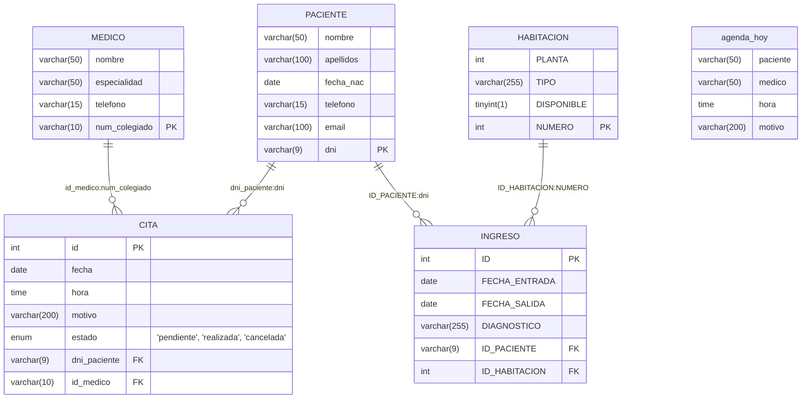

```mermaid
erDiagram
    MEDICO {
        varchar(50) nombre
        varchar(50) especialidad
        varchar(15) telefono
        varchar(10) num_colegiado PK
    }
    
    PACIENTE {
        varchar(50) nombre
        varchar(100) apellidos
        date fecha_nac
        varchar(15) telefono
        varchar(100) email
        varchar(9) dni PK
    }
    
    HABITACION {
        int PLANTA
        varchar(255) TIPO
        tinyint(1) DISPONIBLE
        int NUMERO PK
    }
    
    CITA {
        int id PK
        date fecha
        time hora
        varchar(200) motivo
        enum estado "'pendiente', 'realizada', 'cancelada'"
        varchar(9) dni_paciente FK
        varchar(10) id_medico FK
    }
    
    INGRESO {
        int ID PK
        date FECHA_ENTRADA
        date FECHA_SALIDA
        varchar(255) DIAGNOSTICO
        varchar(9) ID_PACIENTE FK
        int ID_HABITACION FK
    }
    
    agenda_hoy {
        varchar(50) paciente
        varchar(50) medico
        time hora
        varchar(200) motivo
    }

    MEDICO ||--o{ CITA : "id_medico:num_colegiado"
    PACIENTE ||--o{ CITA : "dni_paciente:dni"
    PACIENTE ||--o{ INGRESO : "ID_PACIENTE:dni"
    HABITACION ||--o{ INGRESO : "ID_HABITACION:NUMERO"

```