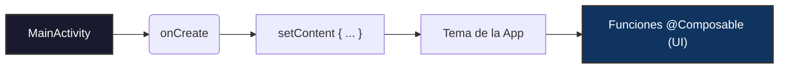

## 1. Arquitectura Base y Anotaciones

Entender cómo se arranca una aplicación en Android y cómo las anotaciones cambian el comportamiento de las funciones de Kotlin.


### 📌 Conceptos Clave

- **`MainActivity` y `onCreate()`**: El punto de entrada de la aplicación en el dispositivo móvil (equivalente al método `main` en otros lenguajes).
    
- **`setContent { ... }`**: Bloque obligatorio que define qué componentes de Compose van a componer e inicializar la interfaz gráfica de la pantalla.
    
- **`@Composable`**: Anotación indispensable para cualquier función que vaya a pintar elementos en la pantalla. Estas funciones no devuelven datos, transforman datos en elementos de interfaz. Por convención, sus nombres siempre empiezan con **Mayúscula** (ej. `GreetingText`).
    
- **`@Preview`**: Permite renderizar la función en el panel de diseño de Android Studio sin necesidad de lanzar el emulador ni conectar el teléfono.
    
    - _Tip:_ Usa `@Preview(showBackground = true, showSystemUi = true)` para ver el diseño con el marco real de un teléfono.
        

### 💻 Ejemplo de Código Base
```kotlin
package com.example.happybirthday

import android.os.Bundle
import androidx.activity.ComponentActivity
import androidx.activity.compose.setContent
import androidx.compose.material3.MaterialTheme
import androidx.compose.material3.Surface
import androidx.compose.runtime.Composable
import androidx.compose.ui.Modifier
import androidx.compose.ui.tooling.preview.Preview
import com.example.happybirthday.ui.theme.HappyBirthdayTheme

class MainActivity : ComponentActivity() {
    override fun onCreate(savedInstanceState: Bundle?) {
        super.onCreate(savedInstanceState)
        setContent {
            HappyBirthdayTheme {
                Surface(color = MaterialTheme.colorScheme.background) {
                    // Aquí se llama a la función principal de la UI
                    GreetingCard(message = "¡Hola Mundo!")
                }
            }
        }
    }
}
```