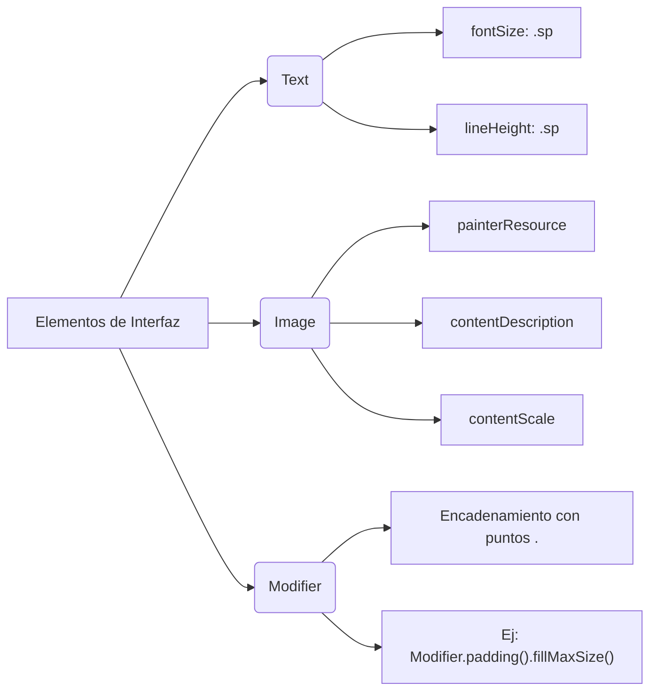

## 2. Elementos Visuales Básicos y Modificadores

Los componentes fundamentales para mostrar información (`Text` e `Image`) junto con el uso de `Modifier` para alterar su estética y comportamiento.

### 📌 Conceptos Clave

- **Unidades de Medida**:
    
    - **`sp` (Scale-independent Pixels)**: Se usa exclusivamente para **textos**. Permite que la tipografía se adapte automáticamente al tamaño de fuente que el usuario tenga configurado en los ajustes de accesibilidad de su teléfono.
        
    - **`dp` (Density-independent Pixels)**: Se usa para **dimensiones, márgenes y rellenos (padding)**. Garantiza que un elemento mida lo mismo físicamente en pantallas de baja o alta resolución.
        
- **`Modifier` (Modificadores)**: Son objetos que permiten decorar o extender un elemento componible. Sirven para asignar tamaños (`fillMaxSize()`), añadir márgenes internos (`padding()`) o alinear componentes. Se encadenan utilizando la sintaxis de puntos.
    
- **⚠️ Regla de Oro Sintáctica**: Al añadir o reordenar parámetros dentro de un bloque en Compose, **cada argumento debe estar estrictamente separado por una coma (`,`)**. Olvidar una coma al final de una línea provocará un error de compilación inmediato en el siguiente parámetro.
    

### 💻 Ejemplo de Código (Text e Image)
```kotlin
import androidx.compose.foundation.Image
import androidx.compose.foundation.layout.padding
import androidx.compose.material3.Text
import androidx.compose.runtime.Composable
import androidx.compose.ui.Modifier
import androidx.compose.ui.layout.ContentScale
import androidx.compose.ui.res.painterResource
import androidx.compose.ui.text.style.TextAlign
import androidx.compose.ui.unit.dp
import androidx.compose.ui.unit.sp

@Composable
fun CardComponent(message: String, modifier: Modifier = Modifier) {
    // Texto formateado correctamente
    Text(
        text = message,
        fontSize = 32.sp,
        lineHeight = 40.sp,
        textAlign = TextAlign.Center,
        modifier = modifier.padding(16.dp) // Uso de dp para espaciado
    )

    // Imagen con escala completa y opacidad
    Image(
        painter = painterResource(id = R.drawable.androidparty),
        contentDescription = "Fondo de tarjeta de felicitación",
        contentScale = ContentScale.Crop, // Recorta para llenar el contenedor sin deformar
        alpha = 0.6F // Opacidad del 60%
    )
}
```