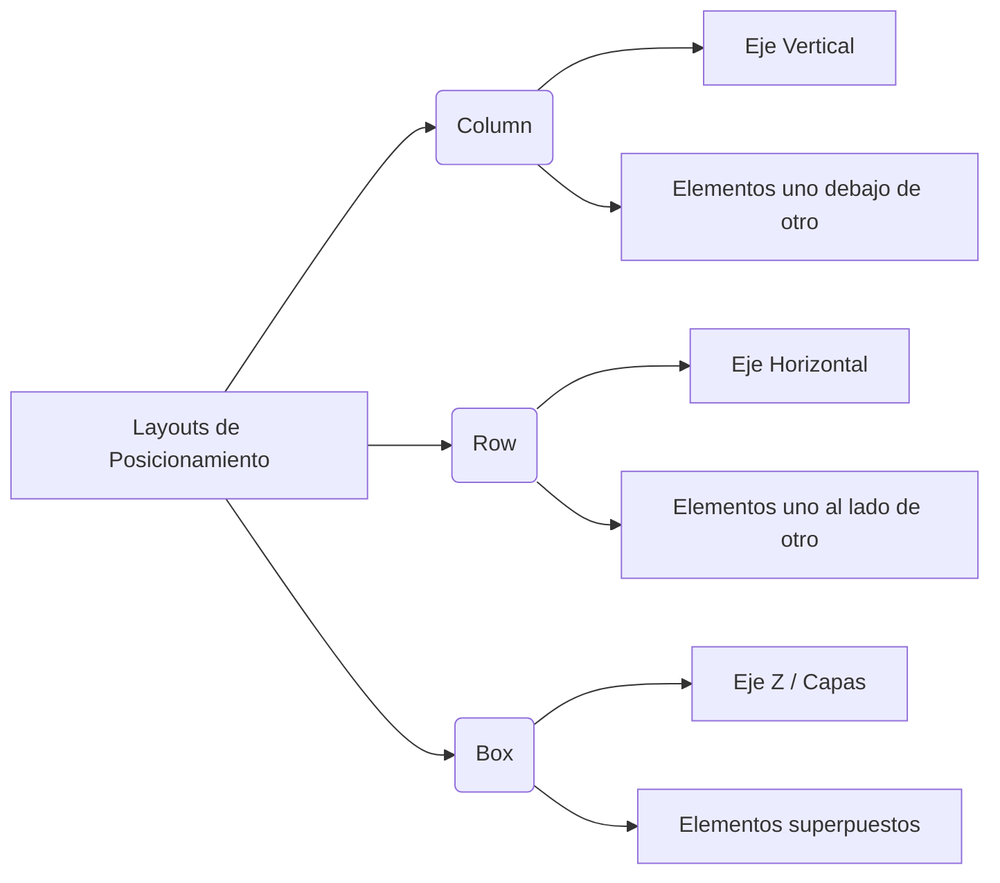

## 3. Layouts Organizadores (Column, Row y Box)

Cómo estructurar y posicionar múltiples elementos en la pantalla para evitar que se superpongan en la esquina superior izquierda `(0,0)`.

### 📌 Conceptos Clave

- **`Column`**: Dispone a sus hijos de forma vertical (arriba a abajo).
    
    - **`verticalArrangement`**: Controla cómo se distribuye el espacio vertical entre los elementos (ej. `Arrangement.Center`, `Arrangement.SpaceBetween`).
        
    - **`horizontalAlignment`**: Controla la alineación horizontal de los elementos dentro de la columna (ej. `Alignment.CenterHorizontally`).
        
- **`Row`**: Dispone a sus hijos de forma horizontal (izquierda a derecha).
    
    - **`horizontalArrangement`**: Distribuye el espacio a lo largo del eje X.
        
    - **`verticalAlignment`**: Alinea los elementos en el eje Y.
        
- **`Box`**: Funciona como una pila de capas. El primer elemento que declaras queda al fondo, y los siguientes se van dibujando encima. Es el contenedor perfecto para definir una **imagen de fondo** y colocar textos descriptivos sobre ella.
    

### 💻 Ejemplo de Código Híbrido (Estructura Completa)
```kotlin
import androidx.compose.foundation.Image
import androidx.compose.foundation.layout.Arrangement
import androidx.compose.foundation.layout.Box
import androidx.compose.foundation.layout.Column
import androidx.compose.foundation.layout.fillMaxSize
import androidx.compose.foundation.layout.padding
import androidx.compose.runtime.Composable
import androidx.compose.ui.Alignment
import androidx.compose.ui.Modifier
import androidx.compose.ui.layout.ContentScale
import androidx.compose.ui.res.painterResource
import androidx.compose.ui.unit.dp

@Composable
fun BirthdayCardView(message: String, from: String, modifier: Modifier = Modifier) {
    // Usamos Box para colocar la imagen al fondo y el texto encima
    Box(modifier = modifier.fillMaxSize()) {
        Image(
            painter = painterResource(id = R.drawable.androidparty),
            contentDescription = null,
            contentScale = ContentScale.Crop,
            modifier = Modifier.fillMaxSize()
        )
        
        // Columna para organizar los textos verticalmente sobre la imagen
        Column(
            viewport = Modifier.fillMaxSize().padding(16.dp),
            verticalArrangement = Arrangement.Center, // Centra el bloque de texto verticalmente
            horizontalAlignment = Alignment.CenterHorizontally // Centra los elementos en el eje X
        ) {
            CardComponent(message = message)
            CardComponent(message = from)
        }
    }
}

@Preview(showBackground = true, showSystemUi = true)
@Composable
fun BirthdayCardPreview() {
    HappyBirthdayTheme {
        BirthdayCardView(message = "¡Feliz Cumpleaños Alex!", from = "De Emma")
    }
}
```