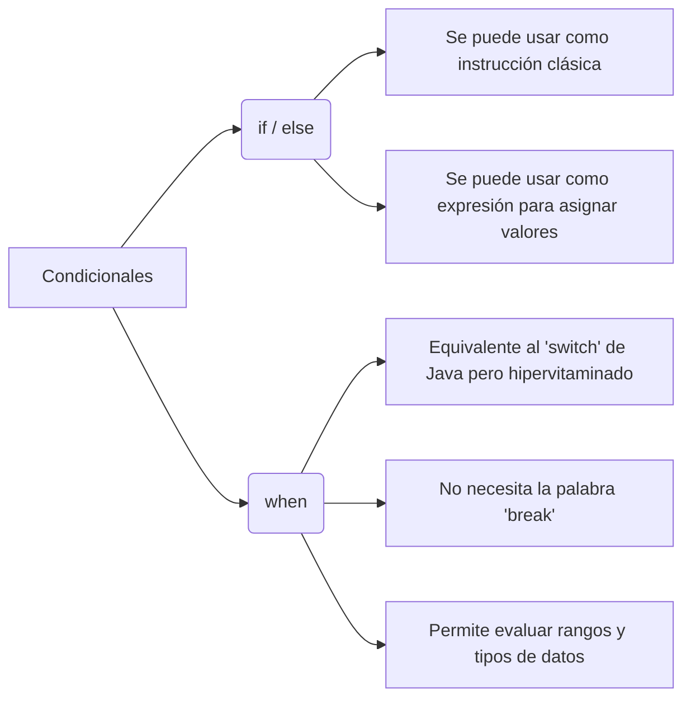

# 1. Escribe condicionales en Kotlin

En Kotlin, los condicionales no solo controlan el flujo, sino que pueden usarse como **expresiones** (es decir, devuelven un valor y se pueden asignar directamente a una variable).

### 📌 Conceptos Clave

- **El fin del operador ternario:** En Kotlin no existe el operador `condicion ? a : b`. Se usa un simple `if-else` en una sola línea porque funciona como expresión.
    
- **La potencia de `when`:** Sustituye a secuencias largas de `if-else if` y al clásico `switch`. Es mucho más legible y versátil.
    

### 💻 Ejemplo de Código
```kotlin
// if-else como expresión
val edad = 20
val estado = if (edad >= 18) "Adulto" else "Menor"

// when devolviendo un valor
val calificacion = 8
val resultado = when (calificacion) {
    10 -> "Matrícula"
    in 7..9 -> "Notable" // Evalúa si está en un rango
    in 5..6 -> "Suficiente"
    else -> "Suspenso" // El 'else' es obligatorio si se usa como expresión
}
```