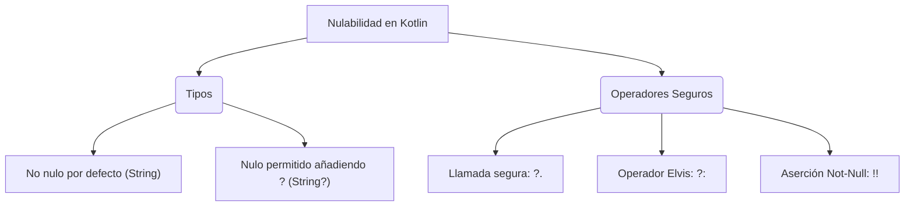

# 2. Usa la nulabilidad en Kotlin

Este es uno de los puntos fuertes del lenguaje. Kotlin está diseñado para eliminar el famoso _NullPointerException_ (el error del billón de dólares) obligándote a gestionar los valores nulos en tiempo de compilación.
