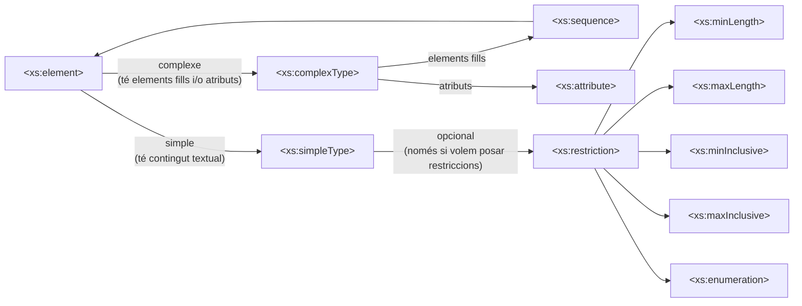

# 🛡️ Validación XML: DTD y XSD

## ¿Qué es validar un documento XML?

- Validar un XML significa comprobar que sigue una estructura esperada.
- Esa estructura se define en un documento externo.
- La validación garantiza:
    - coherencia estructural
    - datos correctos
    - intercambio fiable entre sistemas

Un XML válido siempre debe estar antes bien formado.

---

## Formas de describir la estructura

Las dos formas principales de validación en XML son:

- DTD (Document Type Definition)
- XSD (XML Schema Definition)

---

## 📄 DTD (Document Type Definition)

### ¿Qué es una DTD?

- Define qué estructura debe tener un XML.
- Es la forma más antigua de validación.
- Permite describir:
    - elementos
    - jerarquía
    - orden
    - repetición
    - atributos

---

## Asociación de un XML con una DTD

### DTD externa (recomendada)

```Xml
<!DOCTYPE alumnos SYSTEM "alumnos.dtd">
```

### DTD interna

```Xml
<!DOCTYPE alumnos [
  <!ELEMENT alumnos (alumno+)>
]>
```

---

## Declaración de elementos en DTD

```dtd
<!ELEMENT alumno (nombre, edad)>
<!ELEMENT nombre (#PCDATA)>
<!ELEMENT edad (#PCDATA)>
```

### Tipos de contenido

- `(#PCDATA)` → texto
- `EMPTY` → elemento vacío
- `(elem1, elem2)` → jerarquía

---

## Orden y repetición en DTD

### Orden obligatorio

```dtd
<!ELEMENT alumno (nombre, edad)>
```

### Repetición

- `?` → 0 o 1 vez
- `*` → 0 o más veces
- `+` → 1 o más veces

```dtd
<!ELEMENT alumnos (alumno+)>
```

---

## Atributos en DTD

```dtd
<!ATTLIST elemento atributa tipo condición>
```

- elemento
	- elemento al cual pertenece el atributo
- atributo
	- nombre del atributo
- tipo
	- CDATA (Texto libre)
	- (v1 | v2 | v3) (un valor de una lista cerrada)
	- ID (identificador único)
- condición
	- `#REQUIRED` obligatorio
	- `#IMPLIED` opcional
	- `"valor"` opcional con valor por defecto
	- `#FIXED "valor"` valor fijo 
---

## 📐 XML Schema (XSD)

### ¿Qué es XSD?

- Es una forma moderna y potente de validación.
- Está escrita en XML.
- Permite:
    - tipos de datos
    - restricciones
    - validaciones precisas

---

## Estructura básica de un XSD

```Xml
<xs:schema xmlns:xs="http://www.w3.org/2001/XMLSchema">

</xs:schema>
```

Prefijo habitual: `xs:`

---

## Elementos simples en XSD

```Xml
<xs:element name="edad" type="xs:integer" />
```

Tipos comunes:

- `xs:string` texto
- `xs:integer` nombre entero
- `xs:decimal` nombre decimal
- `xs:boolean` true/false
- `xs:date` fecha

---

## Elementos complejos

```Xml
<xs:element name="alumno">
  <xs:complexType>
    <xs:sequence>
      <xs:element name="nombre" type="xs:string" />
      <xs:element name="edad" type="xs:integer" />
    </xs:sequence>
  </xs:complexType>
</xs:element>
```

---

## Jerarquía, orden y repetición en XSD

```Xml
<xs:element name="alumno" minOccurs="1" maxOccurs="unbounded" />
```

- `minOccurs="0"` → opcional
- `minOccurs="1"` → obligatorio
- `maxOccurs="1"` → una vez
- `maxOccurs="unbounded"` → muchas veces

---

## Restricciones y valores enumerados

```Xml
<xs:simpleType name="grupoTipo">
  <xs:restriction base="xs:string">
    <xs:enumeration value="DAM" />
    <xs:enumeration value="DAW" />
  </xs:restriction>
</xs:simpleType>
```

---

## Atributos en XSD

```Xml
<xs:attribute name="id" type="xs:string" use="required" />
```

Valores comunes de `use`:

- `required` tiene que aparecer
- `optional` puede aparecer o no
- `default` si no está, asume este valor
- `fixed` si está, solo puede tener este valor

---
## Diagrama XSD


## Comparación rápida: DTD vs XSD

|Característica|DTD|XSD|
|---|---|---|
|Sintaxis XML|❌|✅|
|Tipos de datos|❌|✅|
|Restricciones complejas|❌|✅|
|Uso actual|Bajo|Alto|

---

🔗 Relacionado:

- [[Documentos bien formados y válidos]]
- [[Espacios de nombres en XML]]

#xml #dtd #xsd #validacion 