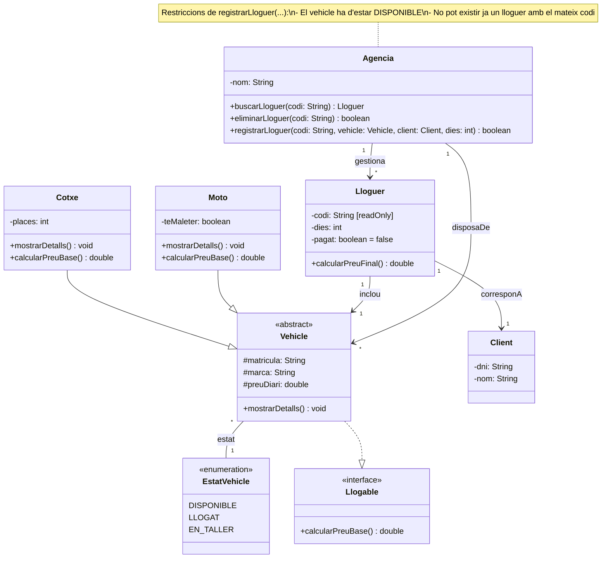

```mermaid
classDiagram
    class EstatVehicle {
        <<enumeration>>
        DISPONIBLE
        LLOGAT
        EN_TALLER
    }

    class Llogable {
        <<interface>>
        +calcularPreuBase() double
    }

    class Vehicle {
        <<abstract>>
        #matricula: String
        #marca: String
        #preuDiari: double
        +mostrarDetalls() void
    }

    class Cotxe {
        -places: int
        +mostrarDetalls() void
        +calcularPreuBase() double
    }

    class Moto {
        -teMaleter: boolean
        +mostrarDetalls() void
        +calcularPreuBase() double
    }

    class Client {
        -dni: String
        -nom: String
    }

    class Lloguer {
        -codi: String [readOnly]
        -dies: int
        -pagat: boolean = false
        +calcularPreuFinal() double
    }

    class Agencia {
        -nom: String
        +buscarLloguer(codi: String) Lloguer
        +eliminarLloguer(codi: String) boolean
        +registrarLloguer(codi: String, vehicle: Vehicle, client: Client, dies: int) boolean
    }

    Vehicle "*" -- "1" EstatVehicle : estat
    Vehicle ..|> Llogable
    Cotxe --|> Vehicle
    Moto --|> Vehicle
    
    Lloguer "1" --> "1" Vehicle : inclou
    Lloguer "1" --> "1" Client : corresponA
    
    Agencia "1" --> "*" Lloguer : gestiona
    Agencia "1" --> "*" Vehicle : disposaDe

    note for Agencia "Restriccions de registrarLloguer(...):\n- El vehicle ha d'estar DISPONIBLE\n- No pot existir ja un lloguer amb el mateix codi"
```