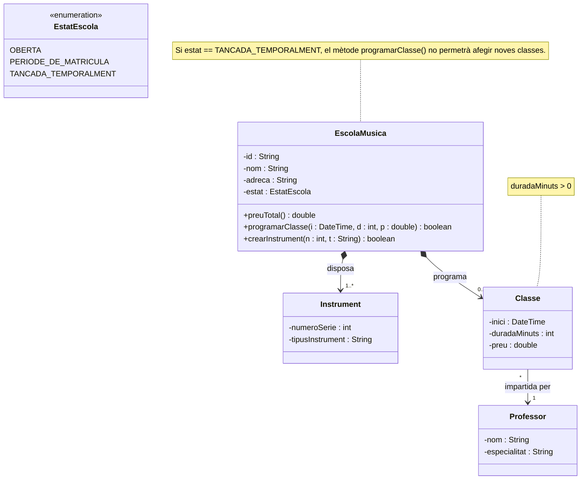

```mermaid
classDiagram

    class EscolaMusica{
        -id : String
        -nom : String
        -adreca : String
        -estat : EstatEscola
        +preuTotal() double
        +programarClasse(i : DateTime, d : int, p : double) boolean
        +crearInstrument(n : int, t : String) boolean
    }

    class EstatEscola{
        <<enumeration>>
        OBERTA
        PERIODE_DE_MATRICULA
        TANCADA_TEMPORALMENT
    }

    class Instrument{
        -numeroSerie : int
        -tipusInstrument : String
    }

    class Classe{
        -inici : DateTime
        -duradaMinuts : int 
        -preu : double
    }

    class Professor{
        -nom : String
        -especialitat : String
    }

    %% Relaciones y multiplicidades corregidas
    EscolaMusica  *--> "0..*" Classe : programa
    EscolaMusica  *--> "1..*" Instrument : disposa
    Classe "*" --> "1" Professor : impartida per

    %% Notas
    note for EscolaMusica "Si estat == TANCADA_TEMPORALMENT, el mètode programarClasse() no permetrà afegir noves classes."
    note for Classe "duradaMinuts > 0"
```