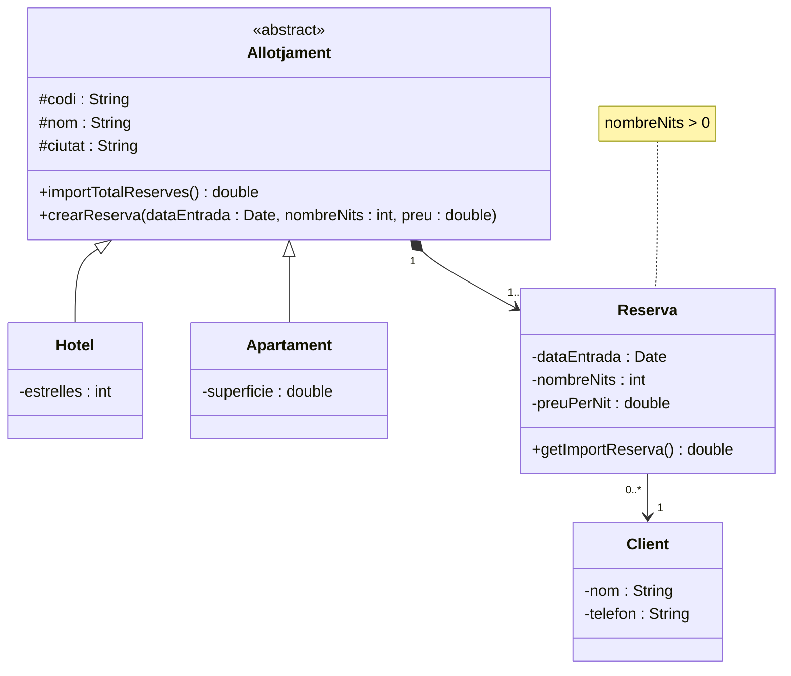

```mermaid
classDiagram
    class Allotjament {
        <<abstract>>
        #codi : String
        #nom : String
        #ciutat : String
        +importTotalReserves() double
        +crearReserva(dataEntrada : Date, nombreNits : int, preu : double)
    }
    class Hotel {
        -estrelles : int
    }
    class Apartament {
        -superficie : double
    }
    class Reserva {
        -dataEntrada : Date
        -nombreNits : int
        -preuPerNit : double
        +getImportReserva() double
    }
    class Client {
        -nom : String
        -telefon : String
    }

    Allotjament <|-- Hotel
    Allotjament <|-- Apartament
    %% Canviem la cardinalitat a 1..* segons l'enunciat
    Allotjament "1" *--> "1..*" Reserva
    Reserva "0..*" --> "1" Client
    
    note for Reserva "nombreNits > 0"
```