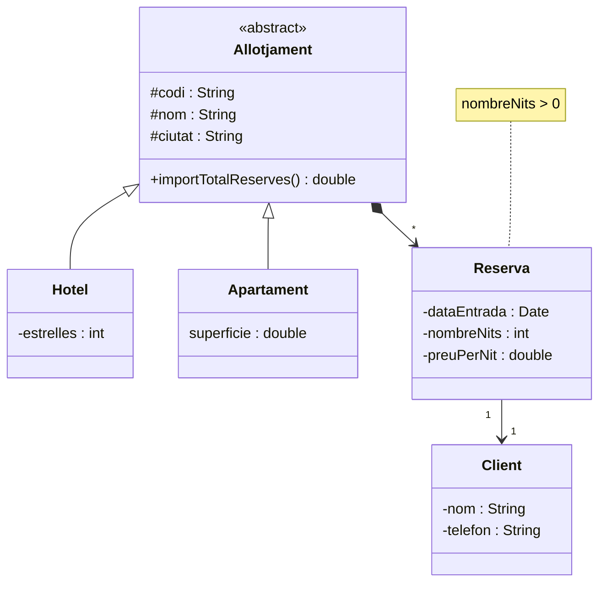

```mermaid
classDiagram
	class Allotjament{
	<<abstract>>
		#codi : String
		#nom : String
		#ciutat : String
		+importTotalReserves() double
	}
	class Hotel{
		-estrelles : int
	}
	class Apartament{
		superficie : double
	}
	class Reserva{
		-dataEntrada : Date
		-nombreNits : int
		-preuPerNit : double
	}
	class Client{
		-nom : String
		-telefon : String
	}
	Allotjament <|-- Hotel
	Allotjament <|-- Apartament
	Allotjament *--> "*" Reserva
	Reserva "1 "--> "1"Client
	note for Reserva "nombreNits > 0"
```