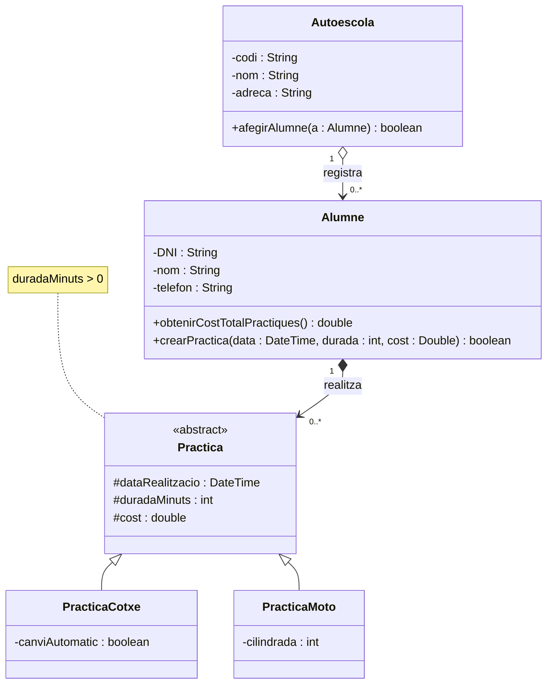

```mermaid
classDiagram

    class Autoescola {
        -codi : String
        -nom : String
        -adreca : String
        +afegirAlumne(a : Alumne) boolean
    }

    class Alumne {
        -DNI : String
        -nom : String
        -telefon : String
        +obtenirCostTotalPractiques() double
        +crearPractica(data : DateTime, durada : int, cost : Double ) boolean
    }

    class Practica {
    <<abstract>>
        #dataRealitzacio : DateTime
        #duradaMinuts : int
        #cost : double
    }

    class PracticaCotxe {
        -canviAutomatic : boolean
    }

    class PracticaMoto {
        -cilindrada : int
    }

    Practica <|-- PracticaCotxe
    Practica <|-- PracticaMoto

    %% Se ajusta 1..* a 0..* para permitir autoescuelas recién creadas sin alumnos
    Autoescola "1" o--> "0..*" Alumne : registra
    Alumne "1" *--> "0..*" Practica : realitza

    note for Practica "duradaMinuts > 0"
```