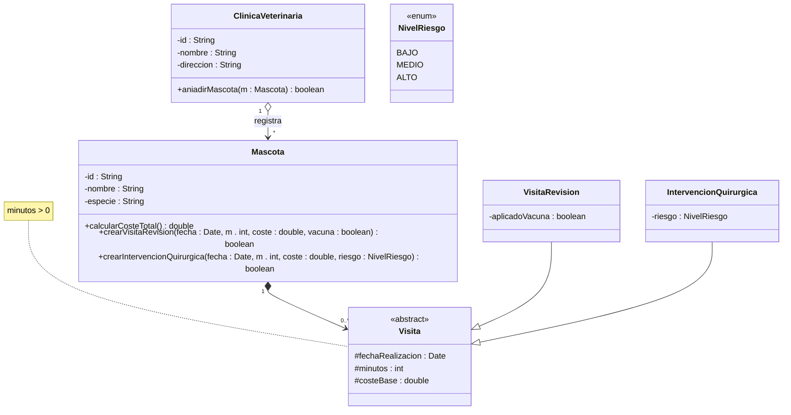

```mermaid
classDiagram
class ClinicaVeterinaria{
	-id : String
	-nombre : String
	-direccion : String
	+aniadirMascota(m : Mascota) boolean
}
class Mascota{
	-id : String
	-nombre : String
	-especie : String
	+calcularCosteTotal() double
	+crearVisitaRevision(fecha : Date, m . int, coste : double, vacuna : boolean) boolean
	+crearIntervencionQuirurgica(fecha : Date, m . int, coste : double, riesgo : NivelRiesgo) boolean
}
class Visita{
	<<abstract>>
	#fechaRealizacion : Date
	#minutos : int
	#costeBase : double
}
class VisitaRevision{
	-aplicadoVacuna : boolean
}
class IntervencionQuirurgica{
	-riesgo : NivelRiesgo
}
class NivelRiesgo{
	<<enum>>
	BAJO
	MEDIO
	ALTO
}
ClinicaVeterinaria "1" o--> "*"  Mascota : registra
Mascota "1" *-->" 0..*" Visita
VisitaRevision --|> Visita
IntervencionQuirurgica --|> Visita

note for Visita "minutos > 0"
```