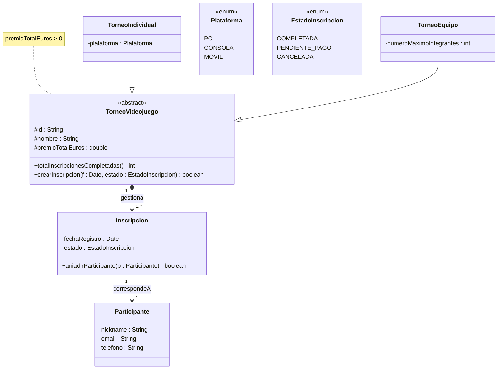

```mermaid
classDiagram
class TorneoVideojuego{
<<abstract>>
	#id : String
	#nombre : String
	#premioTotalEuros : double
	+totalInscripcionesCompletadas() int
	+crearInscripcion(f : Date, estado : EstadoInscripcion) boolean
}
class TorneoIndividual{
	-plataforma : Plataforma
}
class TorneoEquipo{
	-numeroMaximoIntegrantes : int
}
class Plataforma{
<<enum>>
	PC
	CONSOLA
	MOVIL
}
class Inscripcion{
	-fechaRegistro : Date
	-estado : EstadoInscripcion
	+aniadirParticipante(p : Participante) boolean
	
}
class EstadoInscripcion{
<<enum>>
	COMPLETADA
	PENDIENTE_PAGO
	CANCELADA
}
class Participante{
	-nickname : String
	-email : String
	-telefono : String
}
TorneoIndividual --|> TorneoVideojuego
TorneoEquipo --|> TorneoVideojuego

TorneoVideojuego "1" *--> "1..*" Inscripcion : gestiona
Inscripcion "1" --> "1" Participante : correspondeA

note for TorneoVideojuego "premioTotalEuros > 0"
```

